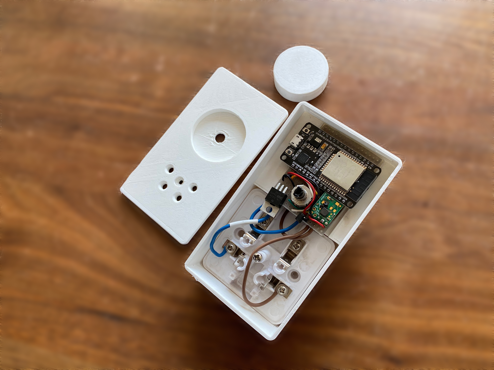
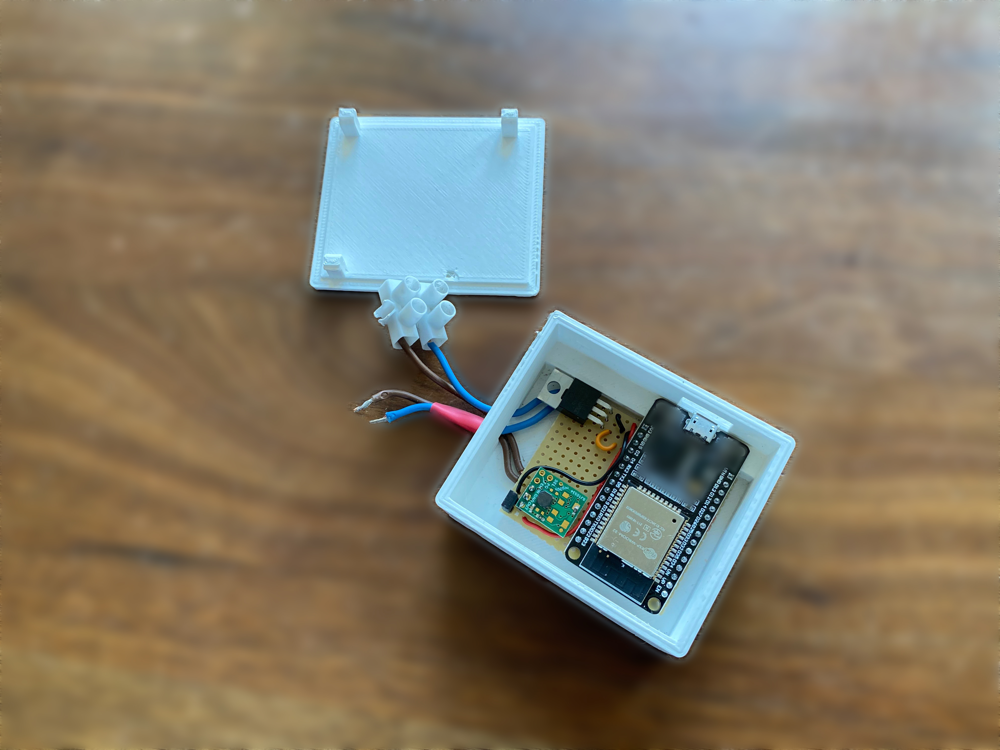
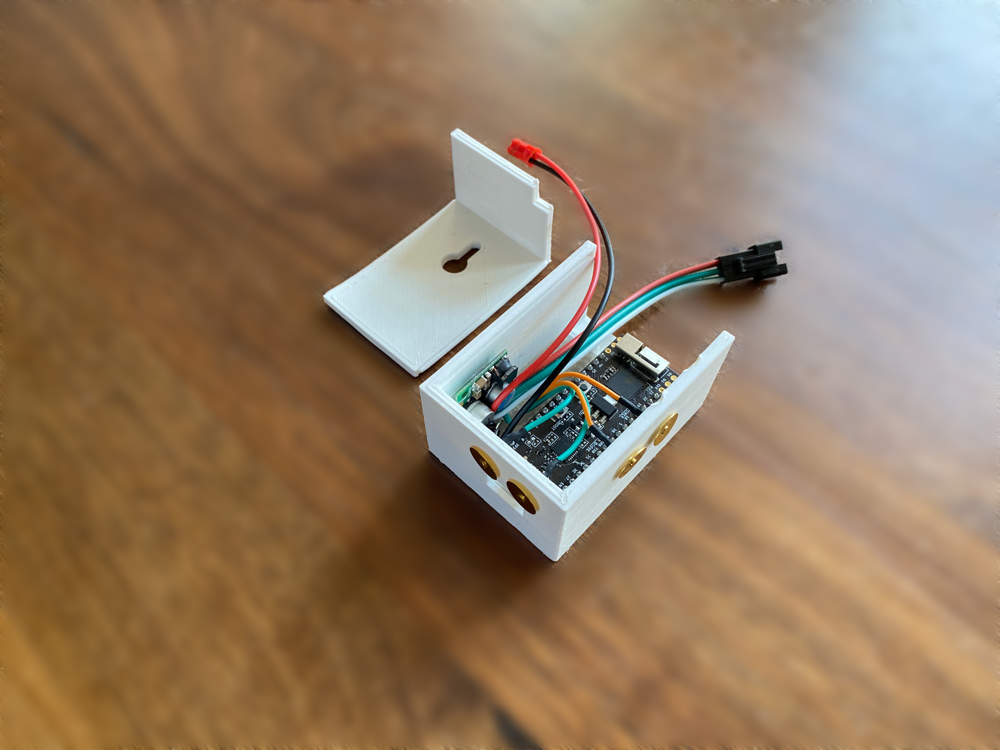

# lissabon off-grid lighting control

Lissabon is an experiment in smart control over off-grid lighting. The intention is to provide a set of small dimmers, remotes and user interfaces that allow you to control lighting. The target application area is strictly low-voltage, battery operated and solar powered. 

> The project got its name from [Tuinpark Lissabon](https://www.tuinparklissabon.nl), an allotment (_"volkstuintje"_ in dutch) in Amsterdam, where the experiment was conducted... 

## Setting

The intended application area is an off-grid premise (holiday home, caravan, boat, etc) with solar cells backed by a 12V battery. Low-voltage LED lights are available as LED strips, MR-16/GU5.4 spots and various other forms, but control hardware - and especially smart home control hardware - is often geared towards use in a 110/220V environment where power is always available and not at a premium.

## Requirements

- _Day-to-day convenience_. Lights can be dimmed or turned on or off with a switch or knob on the fixture or close to it.
- _Predictiveness_. When you press the switch the light goes on or off, within a short time. 
- _Resilience_. In case of system malfunction this should be communicated to the user, and everything should go back to normal quickly. Individual lights should still be controllable on the spot. (All of this excepting a complete loss of battery power, obviously).
- _Low power consumption and very low idle power consumption_. When the lights are off the components should use very little power. So little that the individual components survive in winter, when there is preciously little sun to charge the battery, and the lights still come on when you return after a month of absence.
- _Affordable_. The cost of the control hardware should be reasonable, less than the cost of the lights they control.

The low-power requirement holds for dayly use, it is okay if the components use more power when installing new fixtures or reconfiguring the system.

## Design choices

Lissabon is built on top of the [iotsa](https://github.com/cwi-dis/iotsa) Internet-of-Things framework, using the ESP32 system on a chip, which has WiFi, Bluetooth LE and low power support built in.

Lights are always eased on and off, not switched instantaneously. This looks cool, but it is also the intention that it makes the user less susceptible of any delay in operation.

> This is one of the things that needs to be tested formally.

During normal operation Bluetooth LE is used to communicate, and components are in a wake/sleep cycle. When awake they broadcast their existence with a BLE advertisement (consuming about 50mA). If not contacted within 0.2 seconds by a remote control they go into low power mode (consuming about 5mA) for 2 seconds. As the component has been inactive longer this 2 second sleep period will increase. When a local control (knob, touchpad) is operated the component awakes instantly.

> Deep sleep is not used, even though idle power consumption would go down to about 0.1mA: a wakeup from deep sleep is essentially a reboot, and would consume 100mA for about a second. This means that a deep sleep of less than 20 seconds is essentially a waste of power. This decision may be reconsidered in the future.

When the installation has to be reconfigured all components are sent a BLE instruction that will make them enable WiFi. They will keep WiFi enabled (consuming about 100mA) until they have not been contacted for 2 minutes. The configuration application (when written:-) will run on a smartphone or Raspberry PI that will also provide the WiFi Access Point (software base station).

> Using [igor](https://github.com/cwi-dis/igor) on a Raspberry PI as the basis for the control application needs to be investigated. It may be overkill, but it would allow things like waking PI once per day, and using a 3G/4G or Lorawan connection to "phone home" and report on the status of things like temperature, humidity level, battery level, etc)

## Components

Eventually this repository will contain the central configuration component, but that is future work. Existing components live in separate repositories:

- [lissabonDimmer](https://github.com/cwi-dis/lissabonDimmer) is a dimmer, with buttons, touchpads, rotary control or neither. It is intended for LED lights, monochrome ledstrips or incandescant lights.
- [lissabonLedstrip](https://github.com/cwi-dis/lissabonLedstrip) is a dimmer with buttons, touchpads or neither for smart (neopixel) RGB or RGBW ledstrips.
- [lissabonRemote](https://github.com/cwi-dis/lissabonRemote) is a wireless LiPo-powered remote control that can control a predefined set of dimmers.
- [lissabonController](https://github.com/cwi-dis/lissabonController) is a more elaborate remote control with a display.

## Pictures

Lissabon Dimmer, plug-in variant with rotary control:

Lissabon Dimmer, for use in inaccessible locations:

Ledstrip dimmer, with brightness and color temperature touchpads:

Remote control: to be supplied

Controller: to be supplied

In situ pictures: to be supplied
