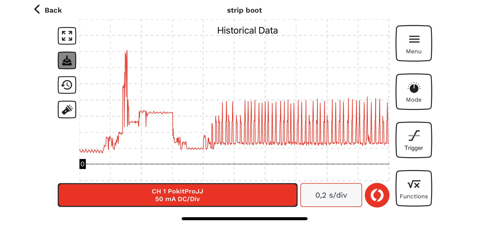
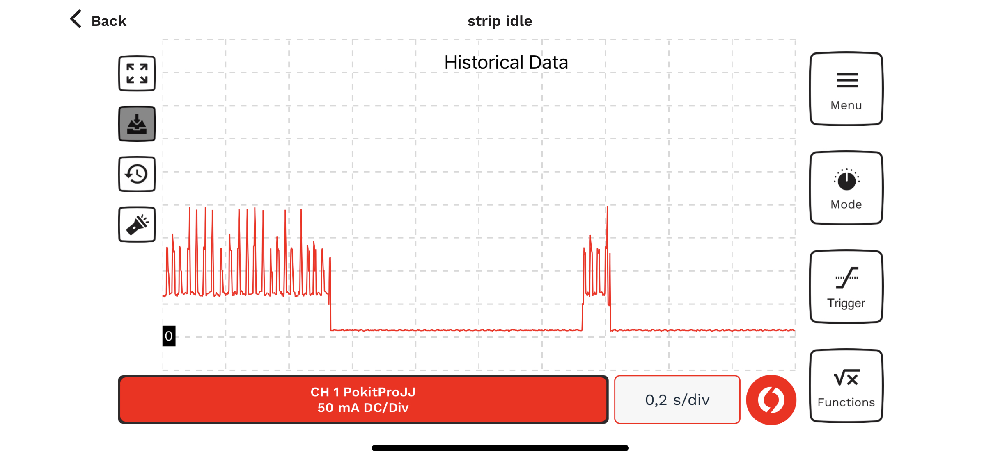
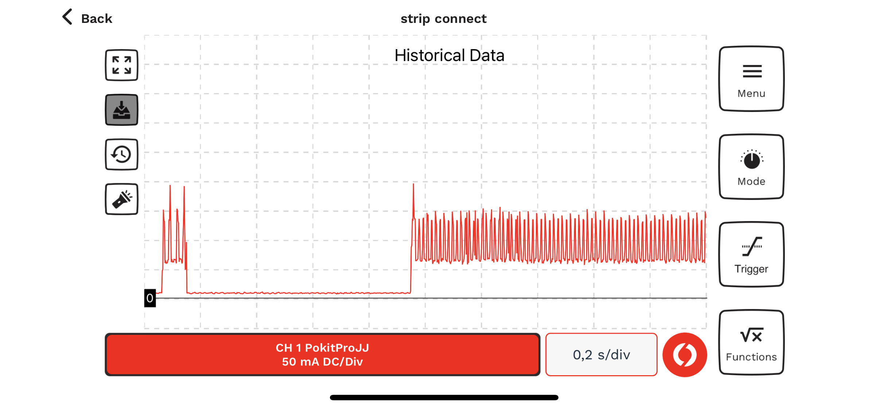

# Power consumption

## BLE power measurements

A set of measurements have been done with a pico32 board connected to a 5V power supply. The red LED on the board had not been removed, so the idle power consumption is a bit too high. This is the board that is used in the ledstrip devices, the board used in the dimmers is different (esp32dev) and will need to be measured separately.

The device had WiFi disabled, and the following parameters for battery and bleserver:

```
striphome:
  bleserver:
    isEnabled:       True
    adv_min:         30
    adv_max:         30
    tx_power:        -1
striphome:
  battery:
    sleepMode:       2
    sleepDuration:   800
    wakeDuration:    80
    bootExtraWakeDuration: 10000
    activityExtraWakeDuration: 2000
    postponeSleep:   2000
    watchdogDuration: 0
    levelVBat:       0
    correctionVBat:  1
    disableSleepOnWiFi: False
```

Or in english: atfer boot stay awake for 10 seconds, then go into a pattern of 80ms awake, 800ms light sleep. After any activity stay awake for an extra 2 seconds. While awake (and not BLE-connected) send out advertisements every 20ms.

Here is the graph of power consumption during boot:



Or in english: boot takes 600ms with a spike of 350mA, then 150mA for 200mS, then 50mA for 200mS. Then we get into a pattern of spikes of 200mA (advertisement, BLE radio transmitter on) and 60mA otherwise (BLE radio receiver on).

After 10 seconds we go to the normal pattern where we advertise for a bit (and possibly get a connection request) and then go to light sleep for a much longer bit:



Or in english: 800mS of light sleep using 7mA, then 80mS of using 60mA (BLE radio receiving) with spikes of 150-200mA (BLE radio transmitting advertisement).

Summarizing: this should give an average power consumption of 13mA at 5V. So in situ, with a Pololu regulator and the LED removed we expect to use about 6mA at 12V.

For completeness here is the data for a BLE connect:



Again: 60mA with the receiver on and 150mA with the transmitter on (but note that the interval between transmissions is now the BLE Connection interval, which is apparently 15mS).