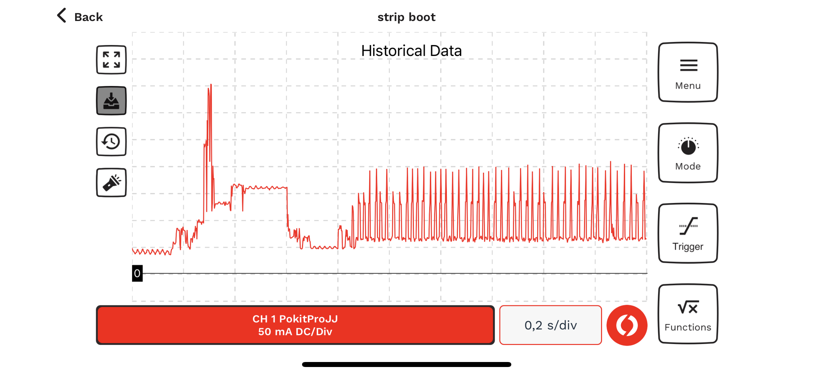
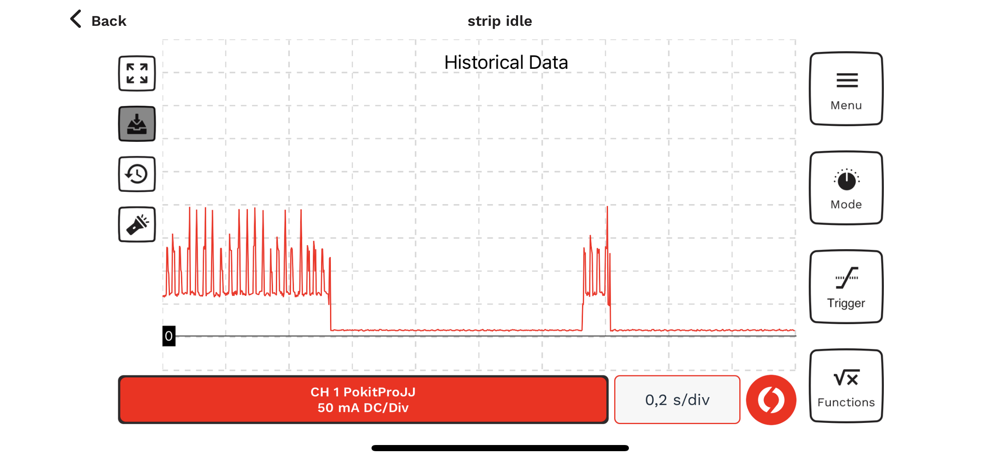
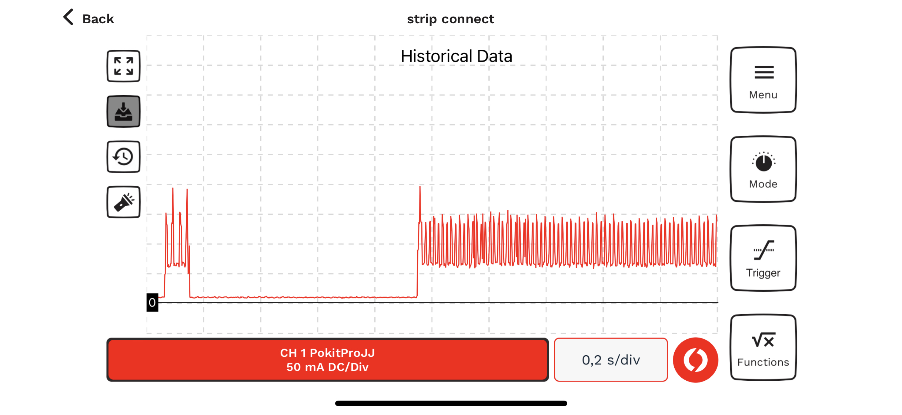

# Power consumption

## BLE power measurements

A set of measurements have been done with a pico32 board connected to a 5V power supply. The red LED on the board had not been removed, so the idle power consumption is a bit too high. This is the board that is used in the ledstrip devices, the board used in the dimmers is different (esp32dev) and will need to be measured separately.

**Note (2026-07-19):** the `sleepDuration`/`wakeDuration` values below (800/80) are what this specific historical measurement session used on a bench-test device (`striphome`, not a currently-deployed device name) -- they are not today's fleet default. Deployed devices now use `sleepDuration=1500`, `wakeDuration=300` (verified against `../../lissabon-config/*/battery.json`), a tighter cycle chosen for better responsiveness -- see `../../iotsa/docs/ble-power-vs-responsiveness.md` for why that tradeoff was made. The graphs and power numbers below are accurate to the 800/80 configuration they were actually captured under and haven't been re-measured at 1500/300; treat the *shape* of the analysis (boot spike, sleep/wake duty cycle, connect behavior) as still representative, but don't read the specific millisecond figures as current.

The device had WiFi disabled, and the following parameters for battery and bleserver:

```
striphome:
  bleserver:
    isEnabled:       True
    adv_min:         30
    adv_max:         30
    tx_power:        -1
striphome:
  battery:
    sleepMode:       2
    sleepDuration:   800
    wakeDuration:    80
    bootExtraWakeDuration: 10000
    activityExtraWakeDuration: 2000
    postponeSleep:   2000
    watchdogDuration: 0
    levelVBat:       0
    correctionVBat:  1
    disableSleepOnWiFi: False
```

Or in english: atfer boot stay awake for 10 seconds, then go into a pattern of 80ms awake, 800ms light sleep. After any activity stay awake for an extra 2 seconds. While awake (and not BLE-connected) send out advertisements every 20ms.

Here is the graph of power consumption during boot:



Or in english: boot takes 600ms with a spike of 350mA, then 150mA for 200mS, then 50mA for 200mS. Then we get into a pattern of spikes of 200mA (advertisement, BLE radio transmitter on) and 60mA otherwise (BLE radio receiver on).

After 10 seconds we go to the normal pattern where we advertise for a bit (and possibly get a connection request) and then go to light sleep for a much longer bit:



Or in english: 800mS of light sleep using 7mA, then 80mS of using 60mA (BLE radio receiving) with spikes of 150-200mA (BLE radio transmitting advertisement).

Summarizing: this should give an average power consumption of 13mA at 5V. So in situ, with a Pololu regulator and the LED removed we expect to use about 6mA at 12V.

For completeness here is the data for a BLE connect:



Again: 60mA with the receiver on and 150mA with the transmitter on (but note that the interval between transmissions is now the BLE Connection interval, which is apparently 15mS).